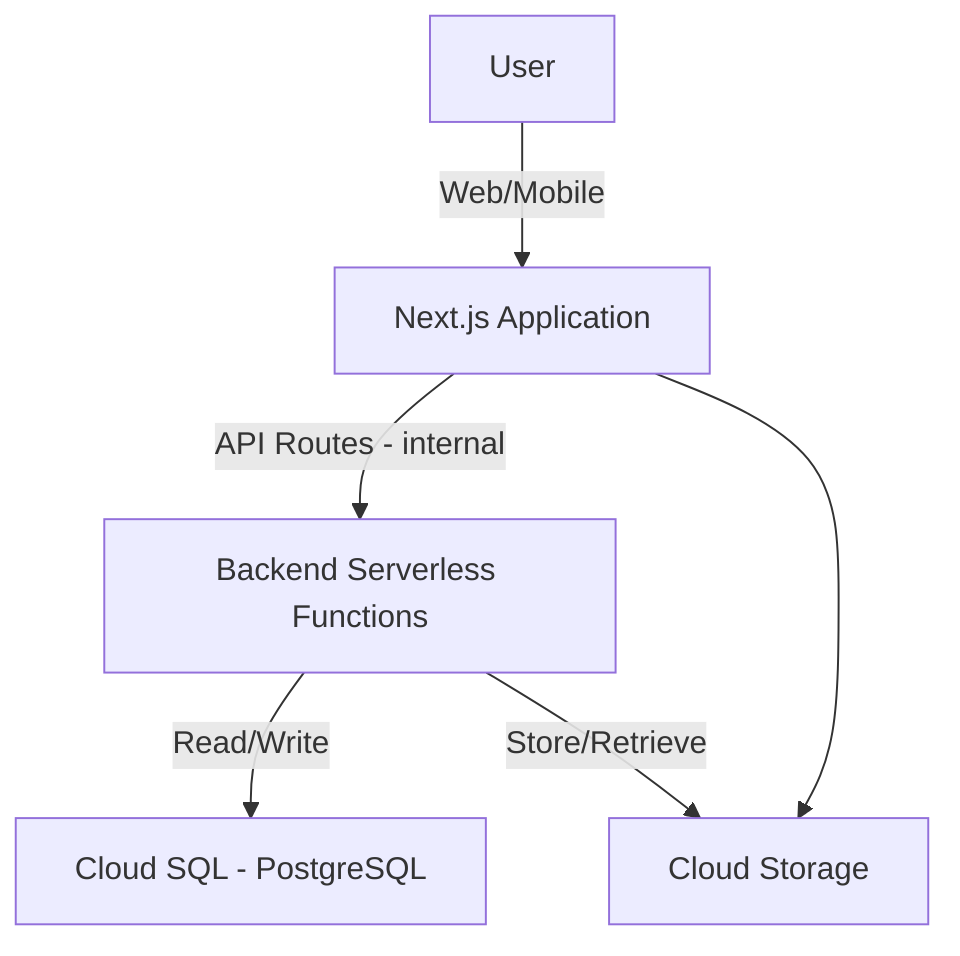
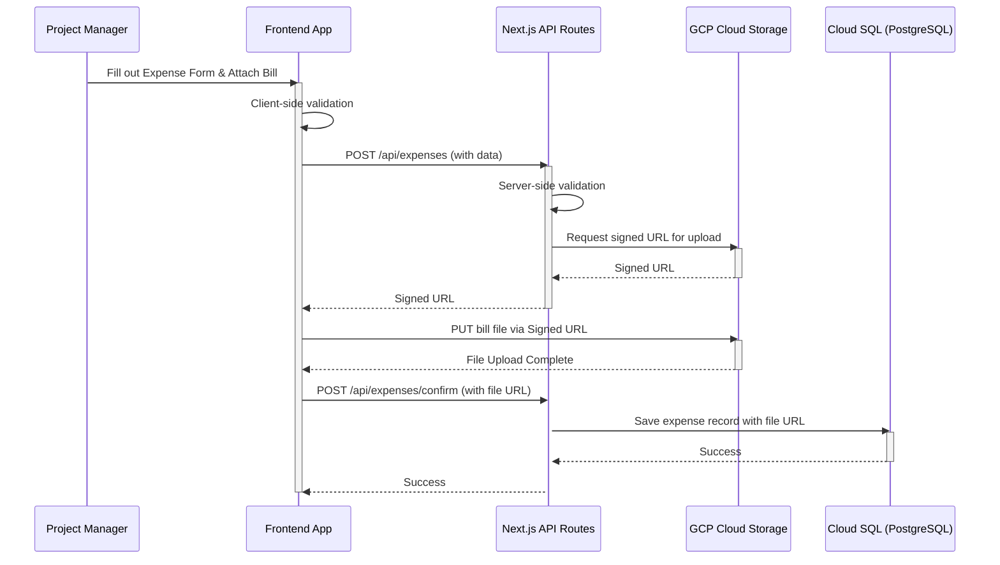

## **Fullstack Architecture Document: Site CashFlow TrackerPro**

### **Introduction**

This document outlines the complete fullstack architecture for **Site CashFlow TrackerPro**, including the backend systems, frontend implementation, and their integration. It serves as the single source of truth for AI-driven development, ensuring consistency across the entire technology stack.

### **Starter Template or Existing Project**

This is a greenfield project being built from scratch. No starter templates or existing codebases will be used, giving us full control over the architecture from the ground up.

-----

## **High Level Architecture**

### **Technical Summary**

The architecture for **Site CashFlow TrackerPro** will be a unified full-stack application built on a modern, component-based approach using **Next.js** and the **Google Cloud Platform (GCP)**. The system will leverage Next.js's integrated front-end and back-end capabilities, simplifying the development and deployment of our API and user interface. It will be deployed to GCP to ensure scalability and accessibility, with all components managed within a single repository to streamline development and deployment.

### **Platform and Infrastructure Choice**

The project will use **Google Cloud Platform (GCP)**. This choice allows us to leverage services like Cloud Functions for our serverless backend, Cloud Storage for file attachments, and Cloud SQL for our PostgreSQL database.

### **Repository Structure**

I recommend a **Monorepo** structure. This approach simplifies code sharing (e.g., TypeScript interfaces for API contracts) and streamlines development with unified build scripts.

### **High Level Architecture Diagram**

### **Architectural and Design Patterns**

  * **Component-Based UI**: For the frontend, we will use a component-based UI framework to promote reusability and maintainability.
  * **API Gateway Pattern**: We will use a single entry point for all API calls to centralize authentication, rate limiting, and monitoring.

-----

## **Tech Stack**

### **Technology Stack Table**

| Category | Technology | Version | Purpose | Rationale |
| :--- | :--- | :--- | :--- | :--- |
| **Full-Stack Framework** | Next.js | `tbd` | Unifies front-end and back-end development. | Simplifies the project for a lean team and provides built-in features like routing and server-side rendering. |
| **UI Component Library**| Tailwind CSS | `tbd` | A utility-first CSS framework. | Speeds up the design process and ensures a consistent look and feel. |
| **State Management** | React Context API & Hooks | `tbd` | Built-in React features for managing state. | Simple and lightweight for the MVP scope, avoiding complex libraries. |
| **API Style** | API Routes (within Next.js) | `tbd` | A file-system-based routing for building APIs. | Allows the front end to communicate with the back end seamlessly. |
| **Database** | PostgreSQL | `tbd` | A robust relational database. | Reliable, flexible, and scalable for our data needs. |
| **File Storage** | GCP Cloud Storage | `tbd` | A highly scalable object storage service. | The GCP equivalent to Amazon S3, perfect for storing our bill attachments. |
| **Authentication** | Firebase Auth | `tbd` | A fully managed service for user authentication. | Provides a secure, scalable solution without the need for custom auth implementation. |

-----

## **Data Models**

This section defines the core data models that will be the foundation of the application.

  * **Project Manager**: Stores information about project managers (`id`, `name`, `contact`, `email`, `status`).
  * **Site**: Stores information about each project site (`id`, `name`, `location`, `projectManagerId`, `status`).
  * **Product/Expense Category**: Categorizes expenses for financial reporting (`id`, `name`, `unit`, `status`).
  * **Expense**: Records money spent on a project site (`id`, `siteId`, `projectManagerId`, `categoryId`, `date`, `amount`, `description`).
  * **Receipt**: Records cash received on a project site (`id`, `projectManagerId`, `siteId`, `date`, `amount`, `referenceNumber`, `remarks`).

-----

## **Components**

This section outlines the major logical components of the full-stack architecture, defining their responsibilities and relationships.

  * **API Routes**: Handles all incoming HTTP requests.
  * **Business Logic/Services**: Contains the core business logic of the application.
  * **Data Access Layer**: Handles all database interactions using the Repository Pattern.
  * **UI/Component Library**: A collection of reusable UI components built with Tailwind CSS.
  * **Pages/Views**: The main user interface, composed of UI components.
  * **Services/API Client**: Manages all communication with the backend API.
  * **Shared Models/Types**: Contains shared TypeScript interfaces and utility functions for both the front end and back end.

-----

## **External APIs**

This section documents all the third-party services and APIs that the application will integrate with.

  * **Firebase Authentication API**: Handles user authentication without building a custom solution.
  * **GCP Cloud Storage API**: Provides highly scalable object storage for bill attachments.

-----

## **Core Workflows**

This diagram illustrates a critical user journey: a Project Manager submitting a new expense with a file attachment.

-----

## **Infrastructure and Deployment**

### **Local Development Setup**

The project will use **Docker** to create a containerized local environment that mimics the production setup on GCP. A `docker-compose.yml` file will be provided to spin up the local database and any other required services. All local development and testing will be done inside these containers to ensure consistency.

### **Deployment Strategy**

The application will be deployed to **Google Cloud Platform** using a container-based approach. The CI/CD pipeline will be responsible for building a Docker image of the Next.js application, pushing it to a container registry, and deploying it to a managed service on GCP.
