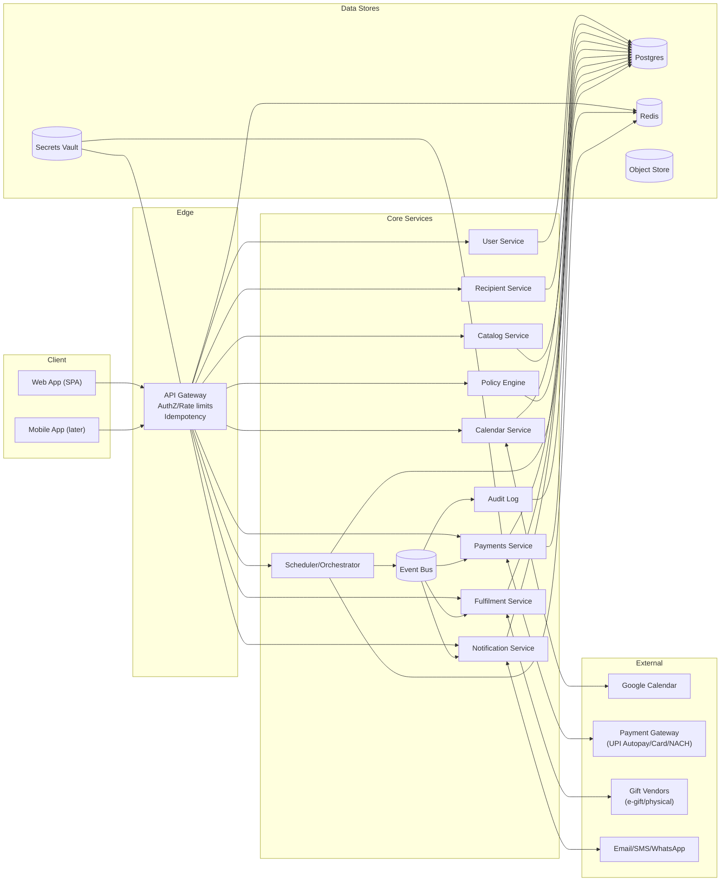
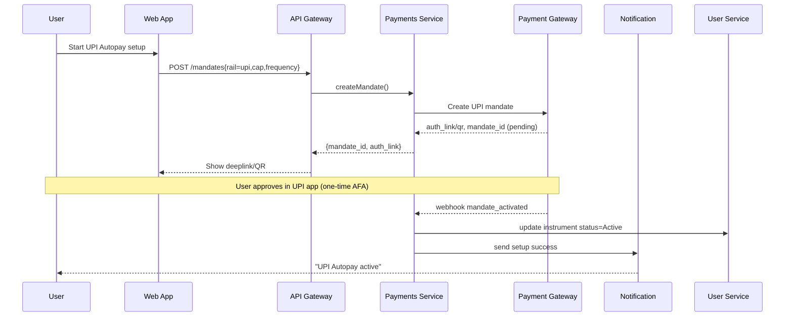
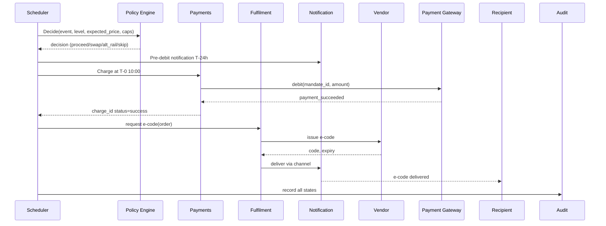
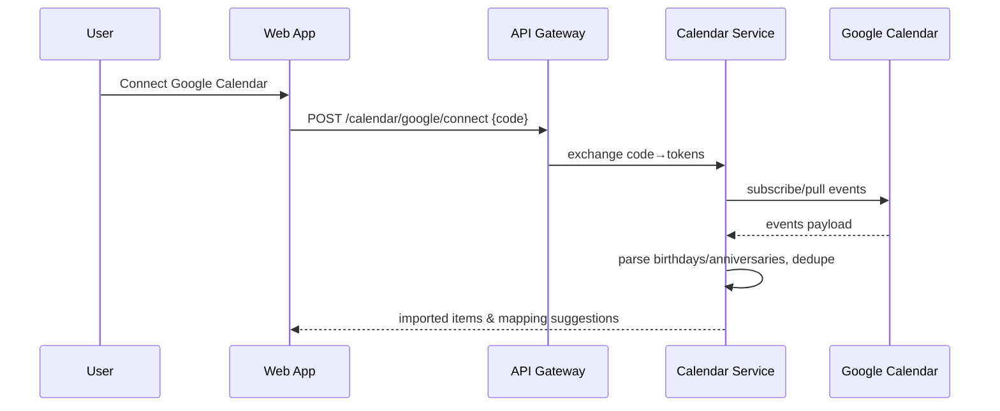
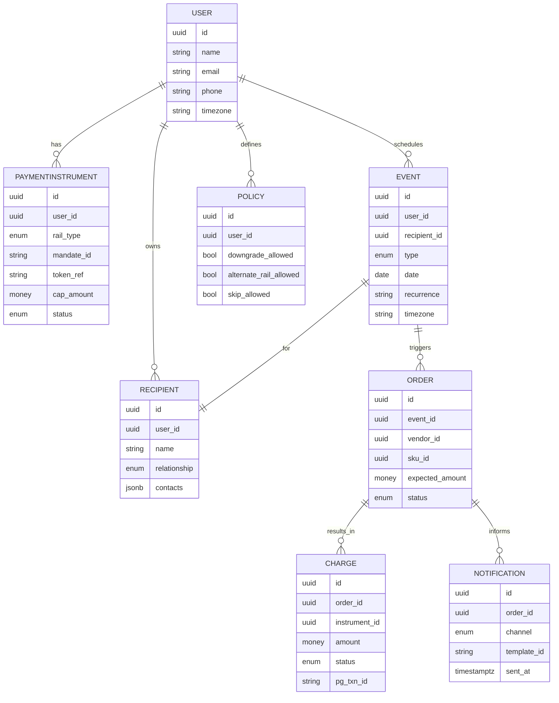
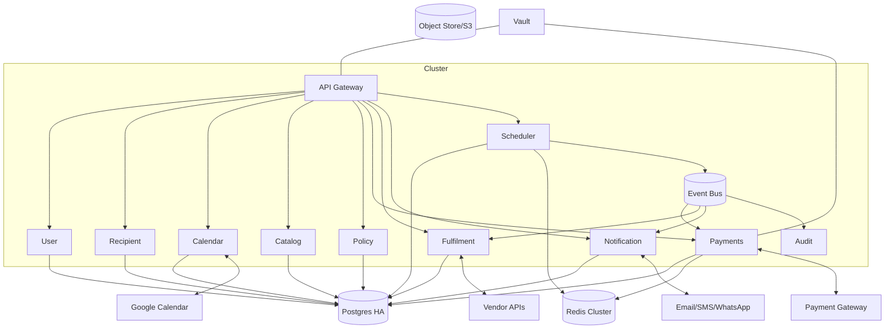
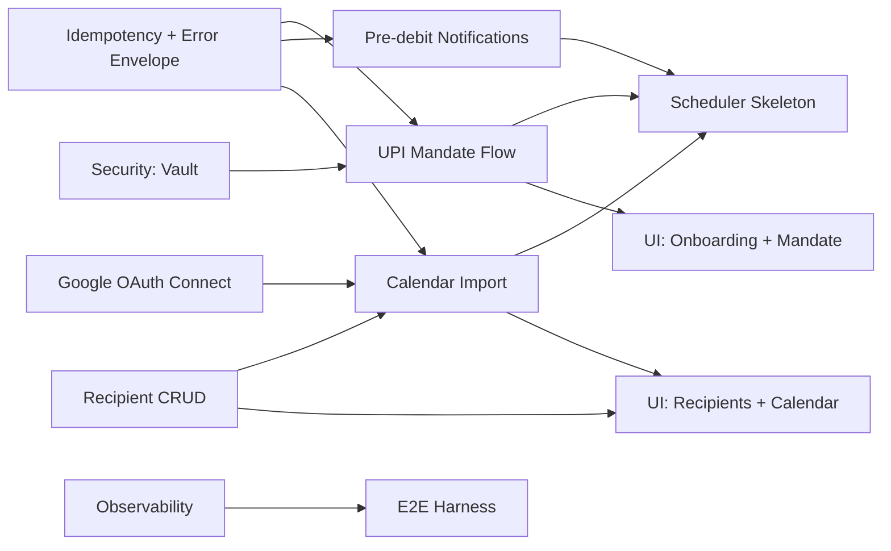
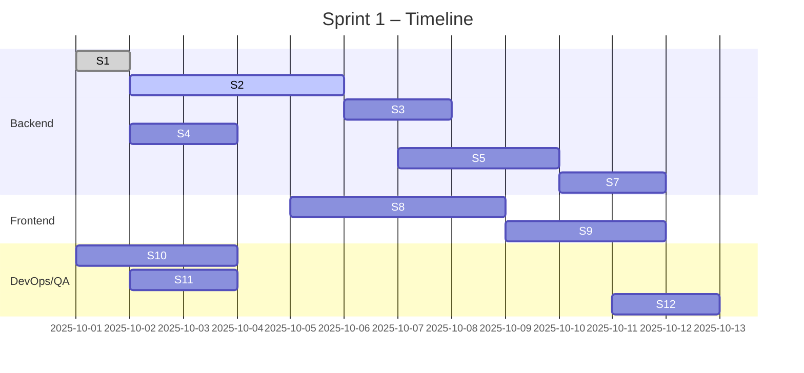

# GiftCare – Diagram Pack, API Patterns, and Sprint 1 Plan (v1)

Owner: Orchestrator  
Complements: PRD and Handoff docs

---

## 1) Mermaid Diagram Pack

### 1.1 System Context (C4‑ish)


### 1.2 Sequence – Onboarding with UPI Autopay Mandate


### 1.3 Sequence – Scheduled Digital Gift Execution


### 1.4 Sequence – Google Calendar Import


### 1.5 Data Model – High Level Entities


### 1.6 Infrastructure Runtime View


---

## 2) API Error Codes & Pagination Patterns

### 2.1 Standard Error Envelope
```json
{
  "error": {
    "code": "string",          // machine-readable (e.g., VALIDATION_FAILED)
    "message": "human summary", // safe for UI
    "field": "optional.path",   // pointer for validation errors
    "retryable": false,          // hint for clients
    "details": {                 // optional structured details
      "constraint": "...",
      "limit": 1000,
      "remaining_window_sec": 7200
    },
    "trace_id": "uuid"
  }
}
```

### 2.2 HTTP Status Mapping & Codes
- **400 BAD_REQUEST**
  - `VALIDATION_FAILED` – payload/schema invalid; include `field` and reason.
  - `UNSUPPORTED_OPERATION` – not allowed in current plan/phase.
- **401 UNAUTHORIZED**
  - `AUTH_REQUIRED` – missing/expired token.
  - `AFA_REQUIRED` – only during initial mandate creation if PG signals interactive step.
- **403 FORBIDDEN**
  - `INSUFFICIENT_SCOPE` – token lacks scope.
  - `MANDATE_NOT_ACTIVE` – attempt to charge without active mandate.
- **404 NOT_FOUND**
  - `RESOURCE_NOT_FOUND` – id not present or not owned by caller.
- **409 CONFLICT**
  - `IDEMPOTENCY_CONFLICT` – same key different payload.
  - `DUPLICATE_RESOURCE` – e.g., duplicate recipient by unique constraint.
- **422 UNPROCESSABLE_ENTITY**
  - `POLICY_BLOCKED` – amount > cap and policy forbids swap/alternate.
  - `VENDOR_UNAVAILABLE` – chosen vendor down or out of stock.
- **429 TOO_MANY_REQUESTS**
  - `RATE_LIMITED` – backoff + `Retry-After` header.
- **500 INTERNAL_SERVER_ERROR**
  - `INTERNAL_ERROR` – unexpected; include `trace_id`.
- **502/503/504 Upstream**
  - `PG_UNAVAILABLE`, `VENDOR_UNAVAILABLE`, `CALENDAR_UNAVAILABLE` – transient retriable.

### 2.3 Idempotency
- All POST/PUT/PATCH support `Idempotency-Key` header (UUIDv4 recommended).
- Server stores (key, request_hash, response, ttl=24h). If key reused with different hash → 409 `IDEMPOTENCY_CONFLICT`.

### 2.4 Pagination Pattern (Cursor‑based)
- Request params: `limit` (1–100, default 25), `cursor` (opaque, base64), `order` (asc|desc by created_at).
- Response envelope:
```json
{
  "data": [ /* items */ ],
  "page": {
    "next_cursor": "opaque-or-null",
    "prev_cursor": "opaque-or-null",
    "limit": 25,
    "order": "desc"
  }
}
```
- Cursors include `(created_at, id)` tuple to avoid duplicates across time.

### 2.5 Problem‑Specific Errors
- `MANDATE_CAP_EXCEEDED` (422): Attempted charge exceeds cap and cannot be adjusted by policy.
- `MANDATE_PAUSED_OR_EXPIRED` (403): Rail inactive; requires user action outside event day.
- `COMPLIANCE_VIOLATION` (403): Operation would break scheme rules (e.g., transaction splitting).
- `SCHEDULE_IN_PAST` (400): Event date invalid/elapsed.
- `RECIPIENT_CONTACT_INVALID` (400): No deliverable channel.

---

## 3) Sprint 1 – Backlog, Story Points, Dependencies

### 3.1 Scope (Phase A focus)
- UPI Autopay mandate onboarding (happy path + webhooks)
- Google Calendar connect + import (read‑only)
- Recipient CRUD + validation
- Scheduler skeleton + pre‑debit notifications
- Error envelope, idempotency, and cursor pagination foundations

### 3.2 Sprint Board (Stories & Points)
| Key | Story | Points | Owner |
|---|---|---:|---|
| S1 | API gateway idempotency + error envelope | 5 | BE |
| S2 | UPI mandate: create + deeplink + webhook activate | 8 | BE |
| S3 | Notification service: send pre‑debit (Email/SMS) | 5 | BE |
| S4 | Google OAuth connect + token store | 5 | BE |
| S5 | Calendar import (birthdays/anniv parse + dedupe) | 8 | BE |
| S6 | Recipient CRUD + validations | 3 | BE |
| S7 | Scheduler skeleton (T‑24h, T‑0 triggers) | 5 | BE |
| S8 | Minimal UI: onboarding flow + mandate status | 8 | FE |
| S9 | Minimal UI: recipients + calendar views | 5 | FE |
| S10| Observability: metrics + trace + dashboards (core) | 5 | DevOps |
| S11| Security: Vault wiring + secret rotation hooks | 3 | DevOps |
| S12| E2E path: seed data + test harness | 5 | QA |

**Total**: 65 pts (2‑week sprint, 6‑8 dev capacity; adjust if team velocity < 55)

### 3.3 Dependency Graph


### 3.4 Gantt (2 weeks)


### 3.5 Definition of Done (Sprint 1)
- End‑to‑end demo: Onboarding → mandate activated → calendar import → pre‑debit sent → (mock) charge executed → digital fulfilment stub delivered.
- Logs/traces visible; error envelope returned by all services; cursor pagination on list endpoints.

---

## 4) Next Steps
- Confirm PG webhook event names and signatures.
- Lock WhatsApp sender (for later) and ensure SMS templates cover pre‑debit.
- Create staging vendor stub with variable price responses for policy testing in Sprint 2.

